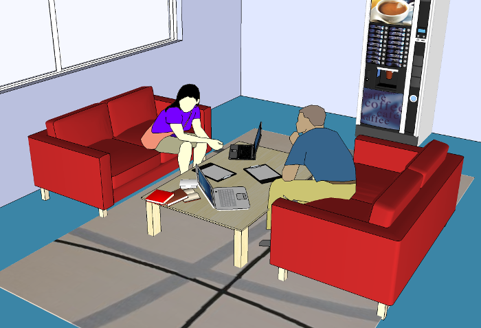
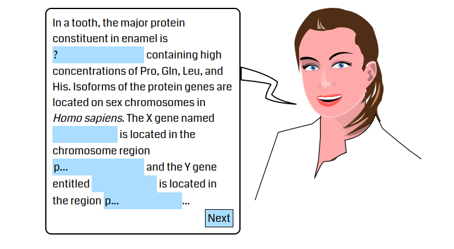
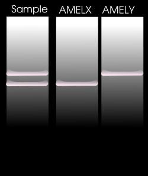

# 1. crime scene


- spot001: 'Yes!! an interesting sample tagged as \'A\'
- spot002: 'Yes!! A tooth... maybe during the fight'
- spot003: 'Yes!! an interesting sample \'C\'
- spot004: 'The corpse was there...'
- spot005: 'Nothing.'
- spot006: 'Nooo!! Only dust'
- spot007: 'Nothing interesting'
- spot008: 'Yes!! an interesting sample  tagged as \'B\'
- spot009: 'Yes!! an interesting sample  tagged as \'D\'


# 2. Forensics Lab - Coffee Room



## Dialog between **Girl** (Sandy) and **Boy** in the coffee room

- **Boy**: 'Hmmmm...',
- **Girl**: 'I received the samples from the police...',
- **Boy**: 'And ? ...',
- **Girl**: 'Four samples come from animals and the tooth is human...',
- **Boy**: 'Interesting! what can we do with the animal samples?',
- **Girl**: 'Don\'t know...',
- **Boy**: 'Maybe DNA barcoding can work...',
- **Girl**: 'Yeees, that can solve my problem.',
- **Boy**: 'We need to extract DNA and sequence some genes...',
- **Girl**: 'We need more details and know which gene to amplify and sequence ...',
- **Boy**: 'Hey you!<br>What are you waiting for?',
- **Girl**: 'You want a coffee?<br>I\'m sorry, I have no coin',
- **Boy**: 'Are you listening to us?<br> Do you have any idea about Sandy\'s problem?'
- **Girl**: 'If you think you can solve my problem,<br>please read my clipboard and answer the questions.'


## Clipboard

DNA Barcode is a unique pattern of `DNA` sequence specific of a living thing. In this technique, short, highly variable regions are of interest. The sequences are extracted from genomes located in `MITOCHONDRION`for animals and `CHLOROPLAST` for plants. These sequences must be amplified with `PCR`. For animals, a region of the gene named `Cytochrome Oxidase` is studied...

- distractors: RNA,???


# 3. Forensics Lab

Once in the lab, you extract DNA and sequence your samples. Here are the results...

```
> Sample#A
AATCGGAGATGACCAAGTCTACAACGTATTAGTAACAGCCCACGCCTTCGTGATAATCTTCTTCATAGTT
ATACCTATTATAATCGGCGGATTCGGAAATTGACTGGTCCCTCTAATGATTGGAGCACCCGACATAGCCT
TCCCTCGTATAAATAACATAAGCTTCTGACTACTCCCTCCTTCCTTCCTACTCTTAATAGCATCCTCAAT

> Sample#B
CGGCAACCTAGCCCATGCAGGGGCATCCGTAGATTTAACTATTTTTTCACTACACCTGGCAGGTGTCTCC
TCAATCTTAGGCGCTATTAATTTTATTACTACTATTATTAATATAAAACCCCCTGCTATATCCCAATACC
AAACACCTCTATTCGTCTGATCGGTCTTAATCACTGCTGTATTGCTACTCCTATCACTGCCAGTTTTAGC

> Sample#C
TCCCCCTGATAATTGGGGCTCCTGACATAGCCTTCCCCCGAATAAATAATATGAGCTTCTGACTTCTCCC
CCCTTCATTCCTTCTTCTACTAGCCTCCTCAATAGTAGAAGCTGGGGCGGGGACTGGCTGAACTGTTTAT
CCACCTCTAGCCGGTAATCTTGCACATGCTGGAGCCTCAGTGGATCTTACTATTTTCTCCCTTCACTTAG

> Sample#D
TTCCACTGCTTGAAGTTATTGTTACGACCACGAAGAAACGACAAATCCCAACTACGGATATATAAGAGCC
AAAACTGCTAAGGGCATTCCATCCAGCGTAAGCATCTGGATAATCTGGAATGCGACGTGGCATACCCGAA
AGCCCTAAGAAATGCATAGGAAAGAAGGTCATATTAACCCCGAAAAAAGTGATCCAAAAATGGATTTGAC
```

## Answers

Use BLAST to find out the various samples origins.

- SampleA: BALAENOPTERA' ('MUSCULUS' || 'BOREALIS' || 'PHYSALUS')
- SampleB: 'PANTHERA' && 'PARDUS' 
- SampleC: 'ORYCTOLAGUS' && 'CUNICULUS'
- SampleD: 'NICOTIANA' && 'TABACUM'


# 4. Mansion


With the help of **Dr. Watson**, you spend the afternoon searching the various guests present the night of the murder.

##  boudoir 

**Miss Pink** reads a fashion magazine while holding a horseshoe. In her purse, you find keys, a mobile phone, a four-leaf clover, a rabbit foot and a rope.
- **Miss Pink**: I'm superstitious and this mansion is reknown to be haunted... **Lord Black** is another victim of the GHOST..." She is terrified.

## dinner

Nobody is in the dining room ... and no coffee ...

## kitchen

**Prof. Violet** is in the kitchen holding a pair of pincers and tweezers. A book on snakes and a python living nestled in a vivarium are on the table close to a candlestick.

- **Prof. Violet**: "These animals are really fascinating...". 
- **You**: Hmmm... He doesn\'t seem really upset by the death of Lord Black.

## gallery

**Colonel Yellow** with his leashed basset hound is admiring the trophies of **Lord Black** especially the whale. After discussion, he shows what he has in his pockets: keys, cell phone, hiking maps. A lead pipe was hidden in the boat...

## hall

In the hall, you meet **Dr Green** with his medical kit bag made of calfskin containing among others a stethoscope, antibiotics and a wrench... 

- **Dr Green**: "I had a flat tire this morning" he said...

## office

The office was cleaned up... 
**Mrs White** with her cat is looking herself in the mirror. 
She has in her purse, a key of her bedroom, a smartphone, a bag of kibble for her cat, and ... a dagger.

## saloon

**Mrs Blue** is a sophisticated old woman. You find these items: various french perfumes, a phone, and... a revolver in her purse in crocodile leather. Looking at the gun, she replied "The world is so dangerous!!!"..

## restroom

The restroom is the only quiet place in this mansion!!! You call the CrazyTownPoliceDpt ...

- Who is guilty? `Miss Pink`
- What is the evidence? `rabbit foot`
- Which bioinformatics tool was used? `BLASTX`

# 5. Gender



Unfortunately, the suspect found in the previous chapter has a good alibi. But, you didn't analyze the tooth found in the crime scene and it is human. You have to determine if it belongs to a man or a woman...

## page0

In a tooth, the major protein constituent in enamel is `id1` containing high concentrations of Pro, Gln, Leu, and His. Isoforms of the protein genes are located on sex chromosomes in _Homo sapiens_. The X gene named `id2` is located in the chromosome region `id3` and the Y gene entitled `id4` is located in the region `id5`...

## page1

For my PCR, I got these primers <ul><li>5'-GCCATAATGGCAAAGA-3'</li><li>5'-CACCACTGGGATGTGG-3'</li></ul>Before beginning my experiment, I want to test them in bioinformatics. For that, I search in the NCBI database `id6` the sequences of the X and Y genes and filter the results with RefSeq. Thus, I download two entries of the X and Y genes corresponding to the locus (or entry name) `id7` and `id8`, respectively.

## page2

Please, give me the lengths of the X and Y amplimers (amplified products) using this primer (Forward and Reverse, respectively)

```
5'-GCCATAATGGCAAAGA-3'
5'-CACCACTGGGATGTGG-3'
```
Just to remind you, the simplest way is to locally align these two short sequences with the gene sequence. Thus, the Forward has a perfect match with X gene at location `id9` and the Reverse at `id10`.
The Forward has a perfect match with Y gene at location `id11` and the Reverse at `id12`.

## page3

To compute the lengths of the amplimers for the X and Y genes, you need the total length of your gene sequence. Then, the formula is <samp>length = (L-R+1) - F + 1</samp>.
Thus, they are respectively `id13` bp and `id14`bp.  

## page4

The previous primer isn't good because the X and Y amplimers are of the exact same lengths. We need a primer producing different amplimers for the X and Y genes. Here is a list of various primers...

```
A
5'-TATTTGGACTCTCTCTGAGGA-3'
5'-TTCTACTACAAGGGTGTTGCA-3'

B
5'-CTGGAGAGCCACAAGCTGAC-3'
5'-TTGCTGTGGACTGCCAAGAG-3'

C
5'-ATAAGTATCGACCTCGTCGGAAG-3'
5'-GCACTTCGCTGCAGAGTACCGAAG-3'

D
5'-CCCTGGGCTCTGTAAAGAATAGTG-3'
5'-ATCAGAGCTTAAACTGGGAAGCTG-3'<

E
5'-ATGATAGAAACGGAAATATG-3'
5'-AGTAGAATGCAAAGGGCTC-3'<
```

The best primer is `id15` producing for X `id16`bp and for Y `id17`bp.

> **Note**: There is an EMBOSS tool to do that very quickly...


## page5

I chose the primer you selected, did the PCR and I get this elecrophoresis gel. Is it a male or female tooth?




- Sex: `M`


## page6

Congratulations!! The code for the mini-game is 'enamel.php'

## Answers


- id1=='amelogenin'
- id2=='AMELX'
- id3=='p22.31-p22.1'
- id4=='AMELY'
- id5=='p11.2'
- id6=='Nucleotide'
- id7=='NG_012040' || 'NG_012040.1' || '237820647'
- id8=='NG_008011' || 'NG_008011.1' || '190341055'
- id9=='10051'
- id10=='4095'
- id11=='10481'
- id12=='4426'
- id13=='205'
- id14=='205'
- id15=='D'
- id16=='106'
- id17=='112'
- sex=='M'

# 6. docks


Witnesses have mentioned a tall man escaping from the mansion of Lord Black during the night of the murder. Moreover, Lord Black of his real name 'Dr Frankenstein' is suspected to work in unofficial labs to create a genetically modified human being.

In addition, rumors indicate that these labs have inserted their signatures to prove the paternity of the first GMM (Genetically Modified Man) and try to sell in the underground market "enhanced humans".

During a raid of the french police at the 'Port de Bordeaux', four containers were investigated but they were unfortunately cleaned on arrival. Nevertheless, scientific police was able to take a few samples:


```
>Container#1
ATGGCACATGCAGCGCAAGTAGGTCTACAAGACGCTACTTCCCCTATCATAGAAGAGCTTATCACCTTTC
ATGATCACGCCCTCATAATCATTTATAACATTGTGGAACGCAGCATTACCGAATTCCTTATCTGCTTCCT
AGTCCTGTATGCCCTTTTCCTAACACTCACAACAAAACTAACTAATACTAACATCTCAGACAGCGAAGGC
GCGCTGGAAAACGCTCAGGAAATAGAAACCGTCTGAACTATCCTGCCCGCC

>Container#2
ATCATCCTAGTCCTCATCGCCCTCCCATCCCTACGCATCCTTTACATAACAGACGAGGTCAACGATCCCT
CCCTTACCATCAAATCAATTGGCCACCAATGGTACTGAACCTACGAGTACACCGACTACGGCGGACTAAT
CTTCAACTCCTACATACTTCCCCCATTATTCCTAGAACCAGGCGACCTGCGACTCCTTGACGTTGACAAT

>Container#3
CATGAGCCGGTATAGTAGGCACTGCTTTGAGCCTCCTCATCCGAGCCGAACTAGGTCAGCCCGGTACTTT
ATGCCCATCATAATTGGGGGCTTTGGAAACTGACTAGTGCCGTTAATAATTGGTGCTCCGGACATGGCAT

>Container#4
CCTCAGCTACTATAATTATTGCAGTTCCTACTGGAATTAAAATTTTTAGTTGATTAGCTACTTTACATGG
AACTCAACTTTCTTATTCTCCAGCTATTTTATGAGCTTTAGGATTTGTTTTTTTATTTACAGTAGGAGGA
TTAACAGGAGTTGTTTTAGCTAATTCATCAGTAGATATTATTTTACATGATACTTATTATGTAGTAGCTC
ATTTTCATTATGTTTTATCTATAGGAGCTGTATTTGCTATTATAGCAGGTTTTATTCACTGATACCCCTT
```

## Answers

```
 cytochrome c oxidase subunit II [Homo sapiens]
Sequence ID: ABB78146.1Length: 227Number of Matches: 1

Alignment statistics for match #1 Score	Expect	Method	Identities	Positives	Gaps	Frame
85.1 bits(209) 	9e-18 	Compositional matrix adjust. 	65/87(75%) 	69/87(79%) 	17/87(19%) 	+1

Query  1    MAHAAQVGLQDATSPIIEELITFHDHALIIIYNIVERSITEFLICFLVlyalfltlttkl  180
            MAHAAQVGLQDATSPI+EELITFHDHAL+II          FLICFLVLYALFLTL+TKL
Sbjct  1    MAHAAQVGLQDATSPIMEELITFHDHALMII----------FLICFLVLYALFLTLSTKL  50

Query  181  tntNISDSEGALENAQEIETV*TILPA  261
            TNTNISD       AQE+ETV TILPA
Sbjct  51   TNTNISD-------AQEMETVWTILPA  70
```

```
 mtCOX2, partial [Homo sapiens]
Sequence ID: BBH72725.1Length: 164Number of Matches: 1

Alignment statistics for match #1 Score	Expect	Method	Identities	Positives	Gaps	Frame
135 bits(340) 	1e-38 	Compositional matrix adjust. 	67/70(96%) 	69/70(98%) 	0/70(0%) 	+1

Query  1    IILVLIALPSLRILYITDEVNDPSLTIKSIGHQWY*TYEYTDYGGLIFNSYILPPLFLEP  180
            IILVLIALPSLRILY+TDEVNDPSLTIKSIGHQWY TYEYTDYGGLIFNSY+LPPLFLEP
Sbjct  51   IILVLIALPSLRILYMTDEVNDPSLTIKSIGHQWYWTYEYTDYGGLIFNSYMLPPLFLEP  110

Query  181  GDLRLLDVDN  210
            GDLRLLDVDN
Sbjct  111  GDLRLLDVDN  120
```

```
 cytochrome oxidase subunit I [Sus scrofa]
Sequence ID: CAA05231.1Length: 514Number of Matches: 2

Alignment statistics for match #1 Score	Expect	Method	Identities	Positives	Gaps	Frame
46.6 bits(109) 	4e-09 	Composition-based stats. 	22/24(92%) 	23/24(95%) 	0/24(0%) 	+3

Query  6   AGIVGTALSLLIRAELGQPGTLCP  77
           AG+VGTALSLLIRAELGQPGTL P
Sbjct  26  AGMVGTALSLLIRAELGQPGTLLP  49
```

```
 cytochrome c oxidase subunit I, partial [Drosophila suzukii]
Sequence ID: ATX74927.1Length: 130Number of Matches: 1

Alignment statistics for match #1 Score	Expect	Method	Identities	Positives	Gaps	Frame
138 bits(348) 	1e-39 	Compositional matrix adjust. 	73/76(96%) 	74/76(97%) 	0/76(0%) 	+3

Query  3    SATIIIAVPTGIKIFS*LATLHGTQLSYSPAIL*ALGFVFLFTVGGLTGVVLANSSVDII  182
            SAT+IIAVPTGIKIFS LATLHGTQLSYSPAIL ALGFVFLFTVGGLTGVVLANSSVDII
Sbjct  55   SATMIIAVPTGIKIFSWLATLHGTQLSYSPAILWALGFVFLFTVGGLTGVVLANSSVDII  114

Query  183  LHDTYYVVAHFHYVLS  230
            LHDTYYVVAHFHYVLS
Sbjct  115  LHDTYYVVAHFHYVLS  130
```
